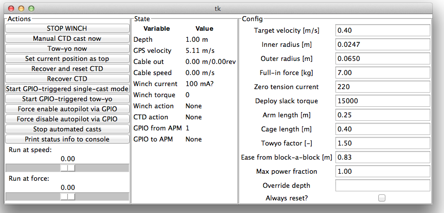

the GUI
===

To start the gui, remote desktop to the Jetyak PC, then double-click "ctd.py" on the desktop.  You should
get a window like this:

Left column:

 * **STOP WINCH** abort any motion commands, stop the winch, engage brake
 * **Manual CTD cast now** based on the current depth, lower and recover the CTD cage, starting immediately
 * **Tow-yo now** repeatedly lower and recover the CTD cage, starting immediately
 * **Set current position as top** set cable out to 0.0, so the current position becomes the new home position
 * **Recover and reset CTD** bring the wire in slowly with constant torque. When the drum stops moving, ease a short distance and call that the new home position.
 * **Recover CTD** bring the CTD back to the home position.  Speed is reduced when the CTD cage is near the surface.
 * **Start GPIO-triggered single-cast mode** listen to Ardupilot and executre a cast when signalled.
 * **Start GPIO-triggered tow-yo** listen to Ardupilot, and tow-yo as long as signal is high.
 * **Force enable autopilot via GPIO** make the PC->Ardupilot signal low, which enables throttle.
 * **Force disable autopilot via GPIO** make the PC->Ardupilot signal high, forcing the throttle to idle.
 * **Stop automated casts** break out of either of the GPIO-triggered modes above
 * **Print status info to console** log some details about motor status to the text console.
 * **Run at speed** the slider is like one axis of a joystick, manually controlling the speed of the winch.
 * **Run at force** similar, but controlling the torque setting
 
 
 
